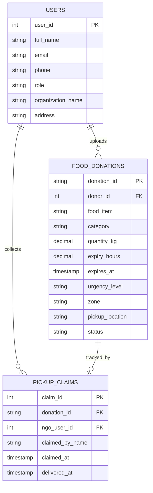

# Entity-Relationship (ER) Diagram – FoodBridge

```mermaid
erDiagram
    USERS ||--o{ FOOD_DONATIONS : uploads
    USERS ||--o{ PICKUP_CLAIMS : collects
    FOOD_DONATIONS ||--o| PICKUP_CLAIMS : tracked_by

    USERS {
        int user_id PK
        string full_name
        string email
        string phone
        string role
        string organization_name
        string address
    }

    FOOD_DONATIONS {
        string donation_id PK
        int donor_id FK
        string food_item
        string category
        decimal quantity_kg
        decimal expiry_hours
        timestamp expires_at
        string urgency_level
        string zone
        string pickup_location
        string status
    }

    PICKUP_CLAIMS {
        int claim_id PK
        string donation_id FK
        int ngo_user_id FK
        string claimed_by_name
        timestamp claimed_at
        timestamp delivered_at
    }
```
